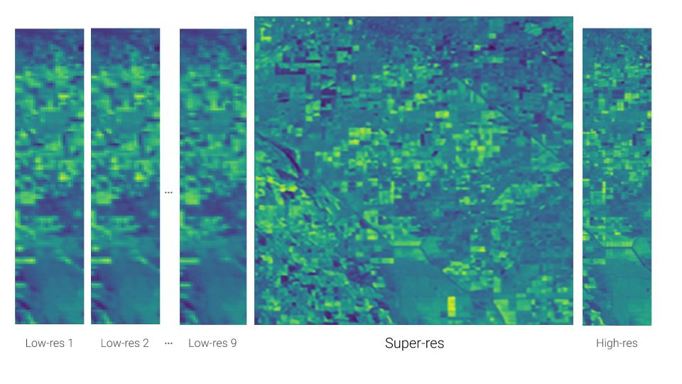
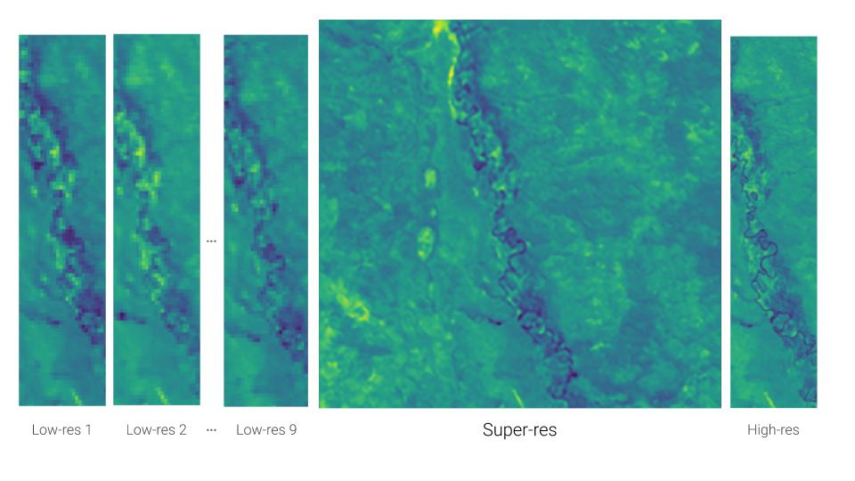

[](https://paperswithcode.com/sota/multi-frame-super-resolution-on-proba-v?p=highres-net-multi-frame-super-resolution-by)

# HighRes-net: Multi Frame Super-Resolution by Recursive Fusion

Pytorch implementation of HighRes-net, a neural network for multi frame super-resolution (MFSR), trained and tested on the [European Space Agency's Kelvin competition](https://kelvins.esa.int/proba-v-super-resolution/home/).

## Computer, enhance please!






**source**: ElementAI blog post [Computer, enhance please!](https://www.elementai.com/news/2019/computer-enhance-please)

**credits**: ESA [Kelvin Competition](https://kelvins.esa.int/proba-v-super-resolution/home/)

## A recipe to enhance the vision of the ESA satellite Proba-V

### Hardware:
The default config should work on a machine with:

GPU: Nvidia Tesla v100, memory 32G

Driver version: CUDA 10.0

CPU: memory 8G to enable running jupyter notebook server and tensorboard server

If your available GPU memory is less than 32G, try following to reduce the memory usage

(1) Work with smaller batches (`batch_size` in config.json)

(2) Work with less low-res views (`n_views` and `min_L` in config.json, `min_L` is minimum number of views (`n_views`)) 

According to our experiments, we estimated the memory consumption (in GB) given `batch_size` and `n_views` 


|   `batch_size` \ `n_views` and `min_L`|**32**| **16**| **4**|
| ----------- |:------:| -----:|  -----:|
| **32** | 27 | 15 | 6|
| **16** | 15 | 8 | 4 |


#### 0. Setup python environment
- Setup a python environment and install dependencies, we need python version >= 3.6.8

```
pip install -r requirements.txt
```

#### 1. Load [data](https://kelvins.esa.int/proba-v-super-resolution/data/) and save clearance

- Download the data from the [Kelvin Competition](https://kelvins.esa.int/proba-v-super-resolution/home/) and unzip it under data/

- Run the save_clearance script to precompute clearance scores for low-res views 

```
python src/save_clearance.py --prefix /path/to/ESA_data
```  

#### 2. Train model and view logs (with TensorboardX)

- Train a model with default config

```
python src/train.py --config config/config.json
```

- View training logs with tensorboardX

```
tensorboard --logdir='tb_logs/'
```  

#### 3. Test model

- Open jupyter notebook and run notebooks/test_model.ipynb
- We assume the jupyter notebook server runs in project root directory. If you start it in somewhere else, 
please change the file path in notebooks accordingly 


You could also use docker-compose file to start jypyter notebook and tensorboard
     	
## Authors

HighRes-net is based on work by team *Rarefin*, an industrial-academic partnership between [ElementAI](https://www.elementai.com/) AI for Good lab in London ([Zhichao Lin](https://github.com/shexiaogui), [Michel Deudon](https://github.com/MichelDeudon), [Alfredo Kalaitzis](https://github.com/alkalait), [Julien Cornebise](https://twitter.com/jcornebise?lang=en-gb)) and [Mila](https://mila.quebec/en/) in Montreal ([Israel Goytom](https://twitter.com/igoytom?lang=en-gb), [Kris Sankaran](http://krisrs1128.github.io/personal-site/), [Md Rifat Arefin](https://github.com/rarefin), [Samira E. Kahou](https://twitter.com/samiraekahou?lang=en), [Vincent Michalski](https://twitter.com/v_michalski?lang=en-gb))

## License
This repo is under apache-2.0 and no harm license, please refer our license file


## Acknowledgments

Special thanks to [Laure Delisle](https://twitter.com/laure_delisle?lang=en), Grace Kiser, [Alexandre Lacoste](https://twitter.com/alex_lacoste_), Yoshua Bengio, Peter Henderson, Manon Gruaz, Morgan Guegan and Santiago Salcido for their support.

We are grateful to [Marcus Märtens](https://www.esa.int/gsp/ACT/team/marcus_maertens.html), [Dario Izzo](https://www.esa.int/gsp/ACT/team/dario_izzo.html), [Andrej Krzic](https://www.esa.int/gsp/ACT/team/andrej_krzic.html) and [Daniel Cox](https://www.esa.int/gsp/ACT/team/daniel_cox.html) from the [Advanced Concept Team](http://www.esa.int/gsp/ACT/about/whoweare.html) of the ESA for organizing this competition and assembling the dataset — we hope our solution will contribute to your vision for scalable environmental monitoring.
